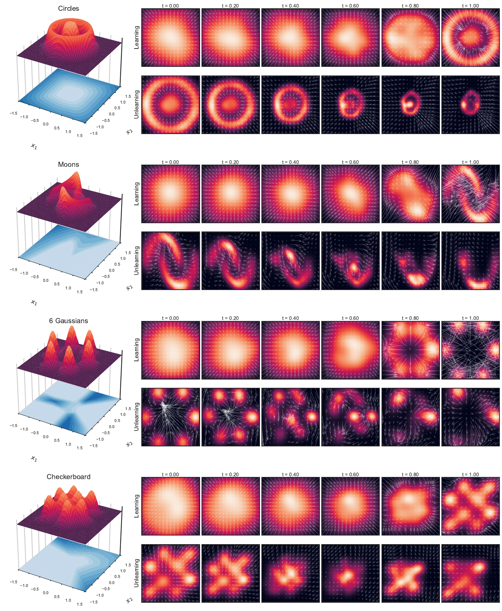

# 🌊 ContinualFlow

**Energy-reweighted flow matching for learning and unlearning** — with a clean, reproducible **2D baseline**.

ContinualFlow trains a neural flow on synthetic 2D geometries, then softly steers generation away from a designated *forget* region using an energy-based reweighting loss — without retraining from scratch.

This repository ships the **canonical 2D experiment pipeline** from our paper:
[ContinualFlow: Learning and Unlearning with Neural Flow Matching](https://openreview.net/forum?id=11uOgdn3nv)
(ICML 2025 Workshop on Machine Unlearning for Generative AI).

> 🎯 Four geometries out of the box: **Circles · Moons · 6 Gaussians · Checkerboard**



---

## ✨ What you get

- 🧪 One-command training + evaluation for four toy geometries
- 💾 Resumable run artifacts under `runs/`
- 🖼️ Unified multi-panel PDF/SVG figure from a completed run
- 🔬 Pytest coverage for datasets, energy orientation, and the full tiny pipeline

---

## 📦 Requirements

- Python **3.10+**
- PyTorch **2.2+** (CPU works; CUDA is used automatically when available)

---

## 🚀 Quickstart

```bash
# create & activate a virtual environment, then:
python -m pip install -e ".[dev]"
```

### Run the full 2D baseline

```bash
python -m continualflow.experiment_2d run --config configs/toy2d_icml.toml
```

This uses **seed 0** and the ICML-small profile. It will:

1. Train an energy classifier + base flow per dataset
2. Fine-tune with energy-reweighted unlearning
3. Evaluate samples and write `metrics.csv`
4. Render `runs/2d/icml-small-seed-0/figures/toy2d_full_page.{pdf,svg}`

Equivalent console entry point:

```bash
continualflow-2d run --config configs/toy2d_icml.toml
```

### Debug on a single dataset

```bash
python -m continualflow.experiment_2d run \
  --config configs/toy2d_icml.toml \
  --dataset circles
```

Repeat `--dataset` for a subset (`moons`, `gaussians`, `checkerboard`).

### Regenerate the figure only

```bash
python -m continualflow.experiment_2d figure --run runs/2d/icml-small-seed-0
```

### Inspect results in a notebook

Open `notebooks/2d_results.ipynb` after a completed run — it only loads artifacts and redraws the figure (no training logic).

---

## 🧩 How the 2D baseline works

| Stage | Role |
|---|---|
| **Data** | Synthetic points + explicit retain / forget labels |
| **Energy** | Classifier → forget-oriented energy surface |
| **Learn** | Standard flow matching on the full distribution |
| **Unlearn** | Energy-reweighted updates that suppress the forget region |
| **Evaluate** | Retention / forget rates, MMD, timing, path metrics |
| **Figure** | Energy maps + learning / unlearning trajectories |

Retain / forget conventions (by design):

- **Circles** — keep the inner ring
- **Moons** — keep one moon
- **Gaussians** — keep even modes `{0,2,4}`
- **Checkerboard** — drop a designated subset of cells

Canonical knobs live in `configs/toy2d_icml.toml` (epochs, `suppression_lambda`, sampling steps, plot grid, …).

---

## 📁 Repository layout

```
configs/          # TOML experiment configs
src/continualflow/
  datasets.py     # 2D data + retain/forget semantics
  energy.py       # classifier + energy / weights
  models.py       # flow network
  training.py     # learn / unlearn / sample
  evaluation.py   # metrics
  plotting.py     # full-page figure
  experiment_2d.py# config, artifacts, resume, CLI
notebooks/        # post-run inspection only
tests/            # unit + tiny end-to-end checks
runs/             # local artifacts (gitignored)
```

---

## ✅ Tests

```bash
pytest
```

---

## 🔒 Resume & reproducibility

- Runs are **config-hashed**: resume is automatic when the hash matches; a mismatched config is rejected.
- Each run records environment metadata (Python, packages, device) in `manifest.json`.
- Deterministic seeding is applied for the configured seed.

---

## 📚 Citation

If you use this code, please cite:

```bibtex
@inproceedings{
simone2025continualflow,
title={ContinualFlow: Learning and Unlearning with Neural Flow Matching},
author={Lorenzo Simone and Davide Bacciu and Shuangge Ma},
booktitle={ICML 2025 Workshop on Machine Unlearning for Generative AI},
year={2025},
url={https://openreview.net/forum?id=11uOgdn3nv}
}
```

---

## 📄 License

See [`LICENSE`](LICENSE).

---

## 🤝 Authors

Lorenzo Simone · Davide Bacciu · Shuangge Ma
